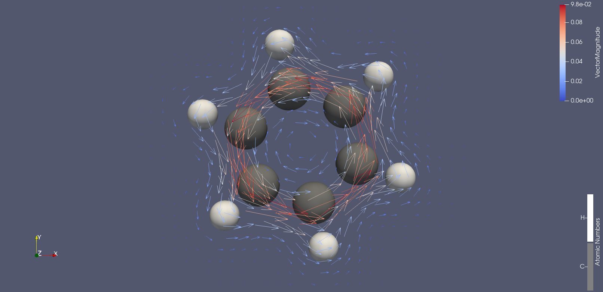
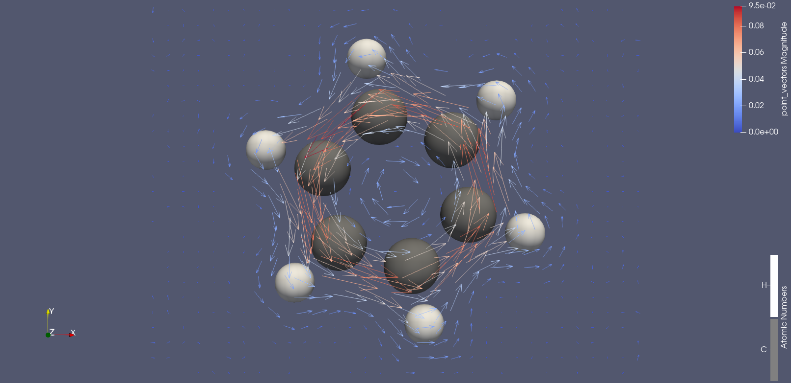

# current-density
Predicting current density in molecules using ML

## Benzene original


## Benzene ML


## Network structure

```
  1. RBF NETWORK (Radial Basis Function)
  ┌─────────────────────────────────────────┐
  │ Input: distances (d) shape: (...,)      │
  │                                         │
  │ d.unsqueeze(-1) → (..., 1)              │
  │                                         │
  │ Expand with centers → (..., C)          │
  │                                         │
  │ diff = d_exp - centers                  │
  │                                         │
  │ exp(-gamma * diff²) → (..., C)          │
  └─────────────────────────────────────────┘
                ↓
                Output: RBF features
  
  2. ATOM MLP NETWORK
  ┌─────────────────────────────────────────┐
  │ Input: [atom_feat_b, rbf] shape: (Nq,Na,F+C)
  │                                         │
  │ Linear(F+C → hidden) → ReLU             │
  │                                         │
  │ Linear(hidden → hidden) → ReLU          │
  └─────────────────────────────────────────┘
                ↓
                Output: hidden features (Nq,Na,H)
  
  3. SCALAR_OUT NETWORK
  ┌─────────────────────────────────────────┐
  │ Input: hidden features (Nq,Na,H)        │
  │                                         │
  │ Linear(H → H/2) → ReLU                  │
  │                                         │
  │ Linear(H/2 → 1)                         │
  └─────────────────────────────────────────┘
                ↓
                Output: scalar weights (Nq,Na)
  
  4. FINAL_PROJ NETWORK
  ┌─────────────────────────────────────────┐
  │ Input: weighted vectors (Nq,3)          │
  │                                         │
  │ Linear(3 → 64) → ReLU                   │
  │                                         │
  │ Linear(64 → 3)                          │
  └─────────────────────────────────────────┘
                ↓
                Output: magnetic field vectors (Nq,3)
```

## Detailed Network Explanations

1. **RBF Network (Radial Basis Function)**
- Purpose: Convert distances into smooth, differentiable features
- Input: Distances between query points and atoms (Nq, Na)
- Process:
    - Creates num_centers evenly spaced centers from 0 to cutoff
    - Computes Gaussian: exp(-gamma * (distance - center)²)
    - Outputs a smooth distance encoding for each center
- Output: (Nq, Na, rbf_centers) - distance features

2. **Atom MLP Network**
- Purpose: Combine atom type features with distance information
- Input: Concatenated [atom_features, rbf_features] shape (Nq, Na, F+C)
- Architecture: `Linear(F+C → hidden) → ReLU → Linear(hidden → hidden) → ReLU`
- Output: Hidden representations (Nq, Na, H) for each (query, atom) pair

3. **Scalar Output Network**
- Purpose: Generate scalar weights for directional contributions
- Input: Hidden features from Atom MLP (Nq, Na, H)
- Architecture: `Linear(H → H/2) → ReLU → Linear(H/2 → 1)`
- Output: Scalar weights (Nq, Na) that determine each atom's influence

4. **Final Projection Network**
- Purpose: Refine the aggregated vector field
- Input: Weighted sum of direction vectors (Nq, 3)
- Architecture: `Linear(3 → 64) → ReLU → Linear(64 → 3)`
- Output: Final magnetic field predictions (Nq, 3)

## Overall Flow
- Compute relative positions and distances between queries and atoms
- RBF expansion converts distances to features
- Atom MLP processes atom type + distance features
- Scalar network generates weights for directional contributions
- Weighted sum creates initial vector field
- Final projection refines the vector field output

This architecture is designed to be equivariant-inspired - it constructs vectors from relative positions (q - r_a) and ensures the output rotates appropriately with coordinate transformations.

## Input to the Network (3 main things):
1. **Atom Information (for all 40 possible atom positions)**
- Atom Positions (40 x 3 array): The X, Y, Z coordinates of where atoms are located
    - Real atoms have their actual coordinates (like a carbon at position x=1.2, y=3.4, z=0)
    - Empty slots are filled with zeros (padding)
- Atom Features (40 x 2 array): What type of atom each position contains
    - `[1.0, 0.0]` = Carbon atom
    - `[0.0, 1.0]` = Hydrogen atom
    - `[0.0, 0.0]` = Empty slot (padding)
- Atom Mask (40 numbers): Which positions actually contain atoms
    - 1 = This is a real atom
    - 0 = This is just padding (empty)

2. **Query Points (Nq x 3 array)**
  - These are the points in space where you want to predict the magnetic field
  - For example, if you have a 10×10×10 grid, that's 1000 query points
  - Each query point has X, Y, Z coordinates

3. Target Values (Nq x 3 array) - Only used during training
- The actual magnetic field vectors (Bx, By, Bz) at each query point
- The network learns to match these

## Visual Example

For Benzene (6C + 6H = 12 real atoms) with max_atoms=40:

```
ATOM POSITIONS (40×3):
[1.2, 0.0, 0.0]  ← Real C atom
[0.6, 1.0, 0.0]  ← Real C atom
...
[0.0, 0.0, 0.0]  ← Padding (28 of these)

ATOM FEATURES (40×2):
[1.0, 0.0]  ← Carbon
[1.0, 0.0]  ← Carbon
[0.0, 1.0]  ← Hydrogen
...
[0.0, 0.0]  ← Padding

ATOM MASK (40):
[1, 1, 1, 1, 1, 1, 1, 1, 1, 1, 1, 1, 0, 0, 0, ...]

QUERY POINTS (say 1000×3):
[0.0, 0.0, 0.0]  ← First grid point
[0.1, 0.0, 0.0]  ← Second grid point
...
```

## What the Network Does

For EACH query point, it:
- Looks at all 40 possible atom positions
- Ignores the padding (thanks to the mask)
- Calculates distance from the query point to each real atom
- Uses the atom type (C vs H) to decide how much each atom influences the field
- Combines the directions from each atom to predict the magnetic field vector

Think of it like: "At this point in space, the magnetic field is the sum of influences from all nearby atoms, with carbon atoms having a different influence than hydrogen atoms."
